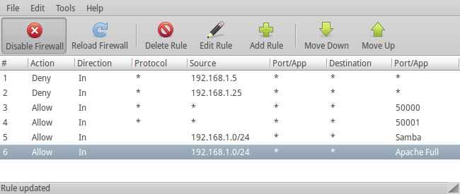
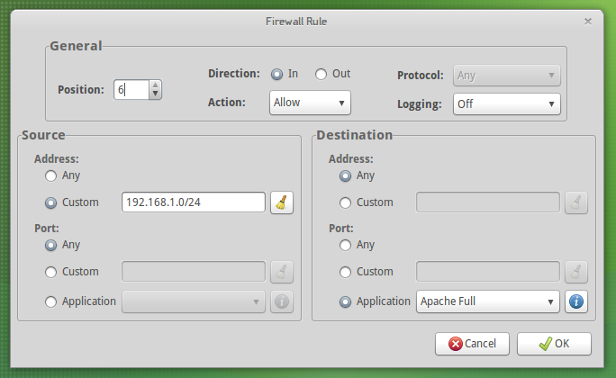

_Currently, UFW provides only a command-line interface (CLI) for user interaction--the ``ufw`` command. This project implements graphical frontends for UFW using PyGTK._

# News
## Version 0.3.2 Released! _(April 6, 2012)_
**Fixed bugs:**
  * Issue #18 (on Google Code)
  * Issue 19 (on Google Code)
  * Issue 20 (on Google Code)
## Version 0.3.1 Released! _(September 11, 2011)_
**Fixed bugs:**
  * Issue 16 (on Google Code)
  * Issue 17 (on Google Code)
## Version 0.3.0 Released! _(September 6, 2011)_
**NOTES:**
  * This will probably be the last _feature_ release of ufw-frontends in its current form. I'm planning a major reorganization of its code using pygtkmvc.
  * Code is now hosted at [GitHub](https://github.com/baudm/ufw-frontends).

**New Features:**
  * View ufw log entries from within ufw-frontends (Events tab).
    
    The entries in the Events tab are parsed directly from the ufw log.
    New events are shown as soon as they appear in the ufw log.
    _This feature requires Pyinotify._

  * Create rules based on the list of events in the event log.
  
    You can use this feature to allow blocked connections.

  * Add support for more IPT modules specifically:
    * nf\_conntrack\_ftp and nf\_nat\_ftp (for FTP)
    * nf\_conntrack\_irc and nf\_nat\_irc (for IRC)
    * nf\_conntrack\_sane (for saned)

**Fixed bugs:**
  * Issue 15 (on Google Code)

# Features
  * Feature parity with the CLI frontend (add/delete rules, enable/disable firewall, show reports, etc.)
  * Supports editing and reordering of existing rules
  * Ability to enable/disable IPv6 support
  * Import/export of rules 1
  * Intuitive and straightforward PyGTK interface

1 **NOTE:** Exported rules are simply shell scripts containing a series of ufw commands, nothing fancy. This approach is advantageous because you can execute the scripts directly.

# What about Gufw?
**Short answer:** Gufw is flawed by design.

This is because it was designed and implemented as a frontend for the CLI, which is a frontend itself. That is, it was designed and implemented as wrapper for a wrapper.

UFW was designed with extensibility in mind. Moreover, it already provides code and interfaces that can be readily extended for creating additional frontends (not just wrappers around the _ufw_ command).

ufw-frontends uses the UFW Python modules directly, thus preventing code duplication, unnecessary code, and an additional layer of execution (ufw-frontends -> iptables vs. Gufw -> CLI -> iptables). This also makes ufw-frontends faster, since it does not call the _ufw_ command for every operation, and more powerful, since it has direct access to the UFW internals. In other words, _it does more with less (code)_.

## ufw-frontends vs. Gufw at a glance
| &nbsp; | **ufw-gtk 0.3.2** | **Gufw 12.04.1** |
|:--|:------------------|:-----------------|
| Toolkits | PyGTK             | GTK+ 3 (via GIR) |
| Code Size | **42.0 KiB**      | 61.7 KiB         |
| Translations | _Partial (via ufw)_ | **Yes**          |
| Edit Rules | **Yes**           | No               |
| Reorder Rules | **Yes**           | No ([LP #605380](https://bugs.launchpad.net/gui-ufw/+bug/605380)) |
| Import/Export Rules | **Yes**           | No ([LP #486285](https://bugs.launchpad.net/gui-ufw/+bug/486285)) |
| App Profiles Support | **Yes**           | No ([LP #963871](https://bugs.launchpad.net/gui-ufw/+bug/963871)) |
| Reports | **Yes**           | No               |
| Additional IPT Modules | **Yes** _(pre-configured)_ | No               |
